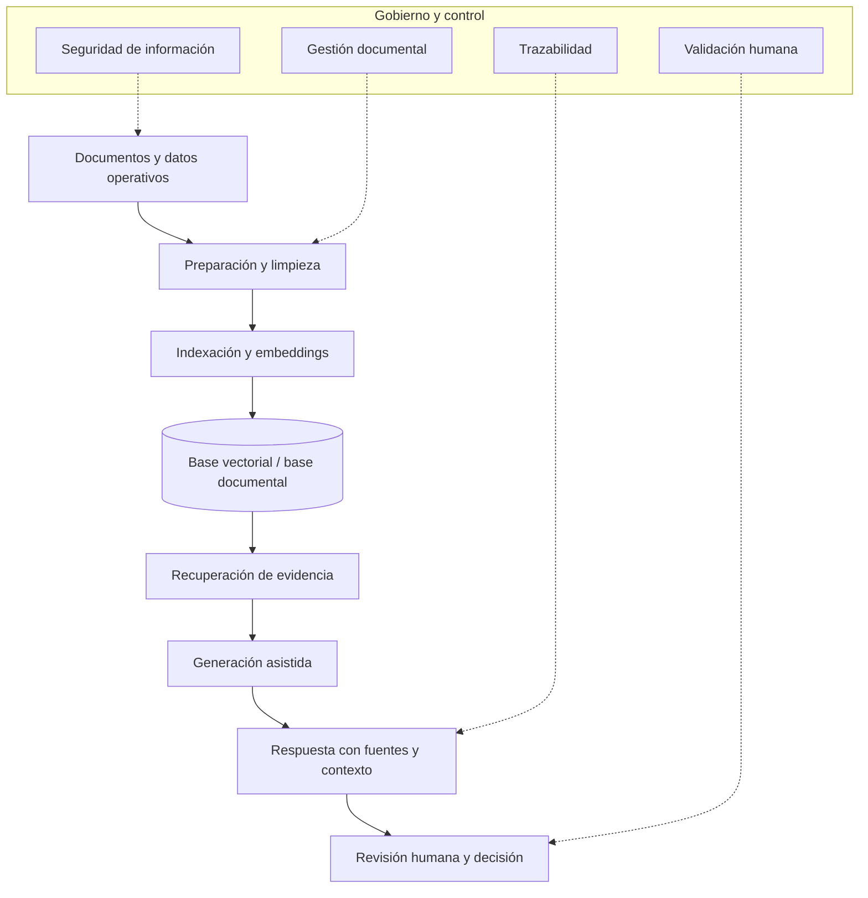

# QMS Intelligence / AI for Quality

Inteligencia documental e inteligencia artificial aplicada a sistemas de gestión de calidad, operaciones y mejora continua.

Este repositorio funciona como índice curado de proyectos orientados a conectar documentación técnica, evidencia operativa y decisiones de calidad mediante sistemas RAG, automatización, analítica e inteligencia artificial aplicada.

El enfoque no es crear chatbots genéricos.

El enfoque es construir herramientas que ayuden a consultar, recuperar, interpretar y conectar información crítica de calidad con trazabilidad, contexto y criterio profesional.

## Propósito

En muchos sistemas de gestión de calidad, la información existe.

Está en procedimientos, especificaciones, CAPA, auditorías, reclamos, reportes, registros, indicadores, lecciones aprendidas y documentos técnicos.

El problema es que no siempre está disponible en el momento correcto, para la persona correcta y con el contexto necesario para decidir.

Esto genera varios riesgos:

- búsquedas manuales lentas;
- decisiones con evidencia incompleta;
- dificultad para conectar reclamos, causas raíz y acciones correctivas;
- uso de documentos obsoletos o no aplicables;
- preparación reactiva ante auditorías;
- pérdida de conocimiento entre equipos, turnos o plantas;
- baja trazabilidad entre información documental y decisiones operativas.

QMS Intelligence / AI for Quality busca reducir esa brecha.

Su objetivo es explorar cómo la inteligencia artificial puede apoyar sistemas de calidad más consultables, trazables y útiles para la toma de decisiones.

## Idea central

La inteligencia artificial puede aportar valor en calidad cuando ayuda a reducir fricción, mejorar trazabilidad y conectar evidencia.

Pero no reemplaza el criterio técnico.

La IA aplicada a calidad necesita:

1. datos y documentos confiables;
2. contexto operativo;
3. trazabilidad de fuentes;
4. validación humana;
5. gobierno de información;
6. límites claros de uso;
7. responsabilidad profesional sobre la decisión final.

La tecnología amplifica el criterio.

No reemplaza la responsabilidad del profesional de calidad.

## Mapa de repositorios

| Área | Repositorio | Propósito |
|---|---|---|
| RAG para calidad y QMS | [RAG_QA](https://github.com/fjgonzalezmgt/RAG_QA) | Sistema RAG para inteligencia documental y soporte operativo basado en evidencia. Orientado a SOPs, CAPA, auditorías, reclamos, especificaciones, reportes de calidad, proyectos DMAIC e indicadores operativos. |
| RAG para conocimiento técnico | [RAG_BOOKS](https://github.com/fjgonzalezmgt/RAG_BOOKS) | Experimentos y componentes relacionados con recuperación aumentada por generación sobre fuentes documentales extensas, libros, guías o materiales técnicos. |

## Líneas principales del proyecto

### 1. Inteligencia documental para QMS

Repositorio principal:

- [RAG_QA](https://github.com/fjgonzalezmgt/RAG_QA)

Esta línea se enfoca en sistemas de recuperación e interpretación de documentos de calidad.

El objetivo es facilitar consultas sobre documentación crítica de QMS y devolver respuestas con evidencia, contexto y trazabilidad.

Casos de uso típicos:

- consulta de procedimientos vigentes;
- preparación de auditorías;
- búsqueda de evidencia por proceso, planta, producto o requisito;
- conexión entre hallazgos, CAPA y documentación aplicable;
- revisión de reclamos y antecedentes relacionados;
- soporte a análisis de recurrencia;
- búsqueda rápida de especificaciones o criterios técnicos.

### 2. IA aplicada a CAPA y causa raíz

Esta línea explora cómo la IA puede apoyar el análisis estructurado de problemas sin sustituir la investigación técnica.

La IA puede ayudar a:

- resumir antecedentes;
- organizar evidencia;
- identificar patrones documentales;
- sugerir preguntas de análisis;
- comparar casos similares;
- preparar borradores de documentación;
- detectar inconsistencias entre causa, acción y evidencia.

Pero la decisión sobre causa raíz, contención, acción correctiva y efectividad sigue siendo responsabilidad del equipo técnico.

Casos de uso típicos:

- revisión de CAPA abiertas o cerradas;
- comparación de acciones correctivas similares;
- identificación de recurrencia en no conformidades;
- apoyo a preparación de 5 Why, Ishikawa o análisis de causa;
- revisión de consistencia entre evidencia y conclusión.

### 3. Preparación de auditorías con evidencia

Esta línea se enfoca en usar IA y recuperación documental para reducir el tiempo de preparación ante auditorías internas, externas, de cliente o proveedor.

El objetivo es facilitar la búsqueda de evidencia relevante sin depender únicamente de memoria, carpetas dispersas o búsquedas manuales.

Casos de uso típicos:

- localizar procedimientos aplicables;
- recuperar registros requeridos;
- identificar evidencias por cláusula, proceso o requisito;
- revisar hallazgos previos;
- conectar acciones correctivas con documentos relacionados;
- preparar paquetes de evidencia para revisión.

### 4. Gestión de conocimiento técnico

Repositorio relacionado:

- [RAG_BOOKS](https://github.com/fjgonzalezmgt/RAG_BOOKS)

Esta línea se enfoca en convertir bibliotecas técnicas, guías, libros, manuales y materiales formativos en conocimiento más consultable.

El objetivo es apoyar aprendizaje, formación técnica y recuperación de conceptos aplicados.

Casos de uso típicos:

- consulta de libros técnicos;
- recuperación de conceptos de calidad, estadística o mejora continua;
- soporte a formación Lean Six Sigma;
- preparación de materiales educativos;
- conexión entre teoría y aplicación operativa;
- construcción de asistentes técnicos especializados.

### 5. QMS aumentado por IA

Esta línea explora una visión más amplia: sistemas de calidad donde la IA ayuda a mejorar visibilidad, trazabilidad y aprendizaje organizacional.

No se trata solo de automatizar documentos.

Se trata de mejorar la capacidad del sistema para responder preguntas como:

- ¿Dónde se ha presentado este problema antes?
- ¿Qué acciones se tomaron?
- ¿Qué evidencia respalda la decisión?
- ¿Qué procedimiento aplica?
- ¿Qué riesgos similares existen?
- ¿Qué reclamos, auditorías o CAPA están relacionados?
- ¿La acción implementada fue efectiva?
- ¿Qué información falta para decidir mejor?

## Arquitectura conceptual

Un sistema QMS Intelligence puede organizarse en capas:



La calidad del sistema depende de toda la cadena.

Un buen modelo no compensa documentos pobres, datos desordenados o falta de gobierno.

## Tipos de documentos objetivo

El enfoque principal está en documentos y registros como:

- SOPs y procedimientos;
- instructivos de trabajo;
- especificaciones de producto;
- especificaciones de proceso;
- especificaciones de empaque;
- CAPA;
- desviaciones;
- no conformidades;
- reclamos de cliente;
- auditorías internas;
- auditorías externas;
- auditorías de cliente o proveedor;
- reportes de calidad;
- indicadores operativos;
- proyectos DMAIC;
- análisis de causa raíz;
- AMEF/FMEA;
- planes de control;
- lecciones aprendidas;
- documentación QMS.

## Usuarios objetivo

Estos proyectos están pensados para:

- gerentes de calidad;
- líderes de operaciones;
- ingenieros de calidad;
- ingenieros de proceso;
- responsables de QMS;
- responsables de CAPA;
- auditores internos;
- líderes Lean Six Sigma;
- equipos de mejora continua;
- analistas de datos operativos;
- equipos de manufactura y supply chain.

El usuario ideal no busca una respuesta automática sin control.

Busca acelerar el análisis, recuperar evidencia y tomar mejores decisiones con trazabilidad.

## Qué problemas busca resolver

Este proyecto responde a problemas frecuentes en sistemas de calidad.

### Información distribuida

La información crítica suele estar en múltiples fuentes, carpetas, formatos y responsables.

La IA puede ayudar a recuperar y conectar información, siempre que exista una estructura mínima de datos y documentos.

### Decisiones lentas

Muchas decisiones se retrasan porque encontrar evidencia toma demasiado tiempo.

Un sistema RAG puede reducir tiempo de búsqueda y acelerar preparación técnica.

### Baja trazabilidad

Cuando la información se usa sin fuente clara, aumenta el riesgo de decisiones débiles.

Por eso, las respuestas deben incluir referencia documental, origen, contexto y límites.

### Conocimiento fragmentado

El conocimiento suele quedar distribuido entre personas, turnos, plantas o departamentos.

La inteligencia documental puede ayudar a preservar y reutilizar conocimiento técnico.

### QMS reactivo

Muchos sistemas de calidad documentan problemas después de que ocurren.

El objetivo es avanzar hacia un sistema que también ayude a aprender, anticipar y conectar señales.

## Qué no busca hacer

Este proyecto no busca:

- reemplazar al profesional de calidad;
- aprobar CAPA automáticamente;
- emitir conclusiones sin evidencia;
- sustituir auditorías;
- tomar decisiones regulatorias de forma autónoma;
- ocultar incertidumbre;
- convertir IA en autoridad técnica final.

La IA puede asistir.

La responsabilidad profesional permanece en las personas.

## Principios de diseño

Los proyectos de esta línea deben seguir estos principios:

1. **Trazabilidad**  
   Toda respuesta relevante debe poder conectarse con documentos o fuentes.

2. **Contexto operativo**  
   La información debe interpretarse considerando proceso, producto, planta, cliente, fecha y tipo documental.

3. **Validación humana**  
   La IA apoya análisis, pero no reemplaza revisión técnica.

4. **Gobierno documental**  
   El sistema debe distinguir documentos vigentes, obsoletos, borradores o no aplicables.

5. **Seguridad de información**  
   La documentación de calidad puede ser sensible y debe tratarse con controles adecuados.

6. **Criterio estadístico y técnico**  
   Los resultados deben revisarse con conocimiento del proceso, datos y sistema de medición.

7. **Uso práctico**  
   La herramienta debe ayudar a decidir mejor, no solo a generar respuestas.

## Flujo típico de uso

Un flujo esperado podría ser:

1. Cargar o conectar documentos de calidad.
2. Clasificar documentos por tipo, proceso, fecha y fuente.
3. Preparar texto y metadatos.
4. Generar embeddings.
5. Almacenar información en base documental o vectorial.
6. Consultar por tema, proceso, caso o requisito.
7. Recuperar fragmentos relevantes.
8. Generar respuesta con contexto.
9. Revisar fuentes.
10. Tomar decisión técnica o continuar investigación.

## Ejemplos de preguntas útiles

### Auditorías

```text
¿Qué evidencias existen para demostrar control del proceso de inspección final?
```

```text
¿Qué hallazgos similares se han registrado en auditorías anteriores?
```

### CAPA

```text
¿Qué CAPA anteriores están relacionadas con defectos de sellado?
```

```text
¿La acción correctiva propuesta está alineada con la causa raíz documentada?
```

### Reclamos

```text
¿Qué reclamos similares se han presentado para este producto o cliente?
```

```text
¿Qué especificaciones, inspecciones o controles aplicaban al lote reclamado?
```

### Procedimientos

```text
¿Qué procedimiento vigente describe el manejo de producto no conforme?
```

```text
¿Qué registros exige este procedimiento?
```

### Mejora continua

```text
¿Qué proyectos DMAIC han tratado problemas relacionados con variación dimensional?
```

```text
¿Qué lecciones aprendidas existen para este tipo de defecto?
```

## Qué demuestra esta línea de proyectos

Esta línea demuestra capacidad para conectar:

- sistemas de gestión de calidad;
- documentación técnica;
- CAPA;
- auditorías;
- reclamos;
- Lean Six Sigma;
- analítica documental;
- bases vectoriales;
- recuperación aumentada por generación;
- inteligencia artificial aplicada;
- soporte a decisiones operativas.

El énfasis está en usar tecnología para fortalecer el sistema de calidad.

No para agregar ruido.

## Relación con Quality Analytics Toolkit

Esta línea complementa el [Quality Analytics Toolkit](https://github.com/fjgonzalezmgt/quality-analytics-toolkit).

Mientras el toolkit se enfoca en herramientas estadísticas y operativas como SPC, Gage R&R, capacidad, FMEA, DOE y muestreo, QMS Intelligence / AI for Quality se enfoca en documentación, evidencia y conocimiento organizacional.

Ambas líneas comparten una misma lógica:

> convertir información disponible en mejores decisiones.

## Roadmap

Mejoras previstas:

- estandarizar estructura de documentos y metadatos;
- agregar ejemplos de consultas por caso de uso;
- incluir flujos de auditoría, CAPA y reclamos;
- documentar arquitectura técnica de referencia;
- definir criterios de evaluación de respuestas;
- agregar controles de trazabilidad;
- mejorar manejo de documentos vigentes y obsoletos;
- crear datasets sintéticos de ejemplo;
- integrar visualización de fuentes recuperadas;
- documentar limitaciones y riesgos de uso;
- preparar casos demostrativos para Quality Analytics.

## Criterios de éxito

Un sistema de QMS Intelligence aporta valor si:

- reduce tiempo de búsqueda;
- mejora trazabilidad de evidencia;
- conecta documentos relacionados;
- ayuda a preparar mejores decisiones;
- reduce dependencia de memoria individual;
- mejora consistencia en análisis técnico;
- fortalece auditorías, CAPA y gestión documental;
- mantiene revisión humana y responsabilidad profesional.

No aporta valor si solo genera texto sin evidencia.

## Sobre el proyecto

QMS Intelligence / AI for Quality es desarrollado por Francisco González como parte de Quality Analytics.

El propósito es explorar y construir soluciones prácticas que conecten calidad, operaciones, documentación, datos e inteligencia artificial para mejorar decisiones en sistemas de gestión de calidad.

Focos principales:

- QMS Intelligence;
- AI for Quality;
- RAG aplicado a calidad;
- CAPA intelligence;
- auditorías con evidencia;
- gestión documental aumentada;
- trazabilidad de decisiones;
- Lean Six Sigma y mejora continua;
- soporte operativo basado en evidencia.

## Enlaces relacionados

- [RAG_QA](https://github.com/fjgonzalezmgt/RAG_QA)
- [RAG_BOOKS](https://github.com/fjgonzalezmgt/RAG_BOOKS)
- [Quality Analytics Toolkit](https://github.com/fjgonzalezmgt/quality-analytics-toolkit)
- [Perfil de GitHub](https://github.com/fjgonzalezmgt)
- [Quality Analytics](https://qualityanalytics.net)
- [LinkedIn](https://www.linkedin.com/in/franciscogonzalez)
