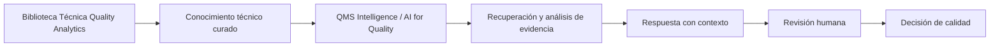
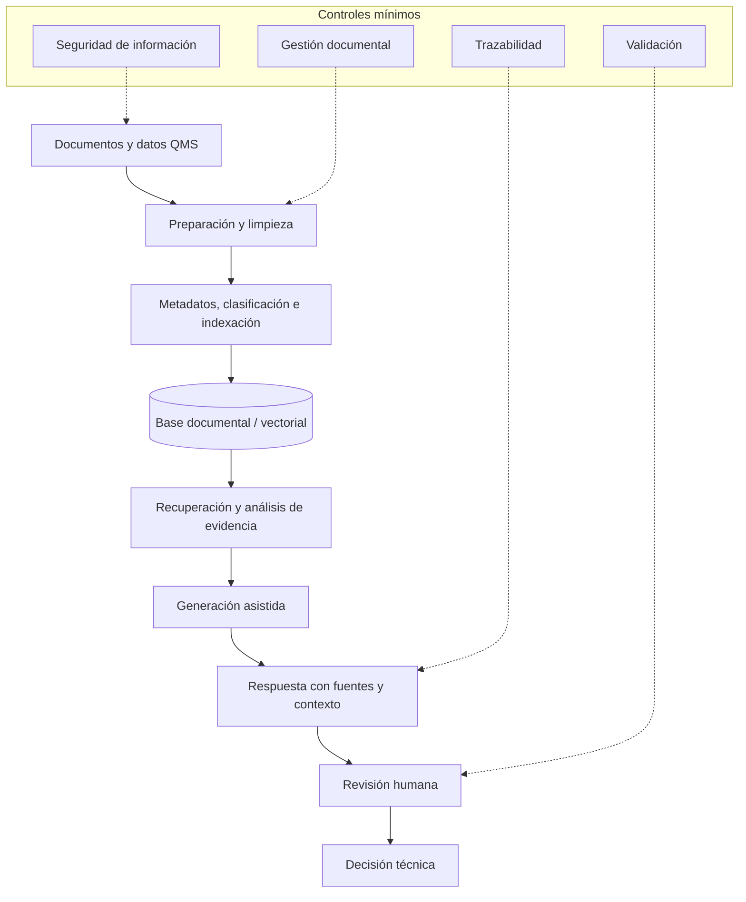

# QMS Intelligence / AI for Quality

Inteligencia documental e inteligencia artificial aplicada a sistemas de gestión de calidad, evidencia operativa y decisiones técnicas con trazabilidad.

Este repositorio es la extensión de **Quality Analytics** orientada a explorar cómo la IA, los sistemas RAG y la automatización documental pueden ayudar a consultar, recuperar y conectar información crítica de calidad.

El foco no es construir chatbots genéricos. El foco es apoyar decisiones de calidad con evidencia, contexto, revisión humana y gobierno de información.

---

## Rol dentro del ecosistema

La biblioteca define el conocimiento técnico. Este repositorio explora cómo hacerlo más consultable y analizable mediante IA, recuperación documental y procesamiento estructurado de datos no estructurados.

---

## Qué problemas atiende

| Si necesitas... | Enfoque relacionado | Decisión que ayuda a mejorar |
|---|---|---|
| Encontrar evidencia documental más rápido | RAG / recuperación de documentos | Qué información respalda una decisión |
| Preparar auditorías con menos fricción | búsqueda por requisito, proceso o documento | Qué evidencia presentar y qué brechas revisar |
| Conectar reclamos, CAPA y antecedentes | inteligencia documental | Si un problema es recurrente o está relacionado con casos previos |
| Analizar grandes volúmenes de comentarios o reseñas | clasificación estructurada y búsqueda semántica | Qué patrones, categorías y señales requieren atención |
| Consultar SOPs o especificaciones | recuperación con contexto | Qué documento aplica y bajo qué condiciones |
| Revisar consistencia de CAPA | análisis asistido | Si causa, acción y evidencia están alineadas |
| Convertir bibliotecas técnicas en consulta práctica | asistentes especializados | Cómo acceder a conocimiento curado sin perder trazabilidad |
| Aplicar IA sin perder control técnico | validación, gobierno y revisión humana | Dónde usar IA con riesgo controlado |

---

## Repositorios incluidos

| Área | Repositorio | Uso principal |
|---|---|---|
| RAG para calidad y QMS | [RAG_QA](https://github.com/fjgonzalezmgt/RAG_QA) | Sistema RAG para inteligencia documental y soporte operativo basado en evidencia |
| Voz del cliente y análisis semántico | [sentiment_analysis](https://github.com/fjgonzalezmgt/sentiment_analysis) | Pipeline reproducible para clasificar reseñas, validar resultados, reducir costos mediante Batch API y habilitar búsqueda semántica con Chroma |

---

## Arquitectura conceptual

Un buen modelo no compensa documentos pobres, datos desordenados o falta de gobierno. La calidad del sistema depende de toda la cadena.

---

## Casos de uso típicos

- Consulta de procedimientos vigentes.
- Preparación de auditorías internas, externas, de cliente o proveedor.
- Búsqueda de evidencia por proceso, planta, producto, requisito o fecha.
- Conexión entre hallazgos, CAPA, reclamos y documentación aplicable.
- Revisión de antecedentes de no conformidades o reclamos.
- Clasificación y análisis semántico de comentarios, reseñas o voz del cliente.
- Identificación de patrones recurrentes en categorías de servicio o calidad.
- Soporte a análisis de recurrencia.
- Consulta de especificaciones o criterios técnicos.
- Asistentes técnicos basados en bibliotecas curadas.

---

## Principios de diseño

- Trazabilidad hacia fuentes o documentos definidos.
- Contexto operativo: proceso, producto, planta, cliente, fecha y tipo documental.
- Revisión humana antes de usar una respuesta para decidir.
- Gobierno documental para distinguir documentos vigentes, obsoletos o no aplicables.
- Seguridad de información para documentación sensible.
- Validación de esquemas, taxonomías y reglas antes de aceptar salidas del modelo.
- Límites claros de uso.
- IA como asistencia, no como autoridad técnica final.

---

## Qué no busca hacer

Este repositorio no busca:

- reemplazar al profesional de calidad;
- aprobar CAPA automáticamente;
- emitir conclusiones sin evidencia;
- sustituir auditorías;
- tomar decisiones regulatorias de forma autónoma;
- ocultar incertidumbre;
- convertir IA en autoridad técnica final.

La IA puede reducir fricción y mejorar acceso a evidencia. La responsabilidad profesional permanece en las personas.

---

## Chatbot de Quality Analytics

Como demostración aplicada, el sitio de [Quality Analytics](https://qualityanalytics.net/) incluye un chatbot con recuperación aumentada por generación.

El asistente consulta contenido técnico publicado por Quality Analytics, incluyendo artículos, guías, materiales de calidad, sistemas de gestión, Lean Six Sigma y analítica aplicada.

Su función es facilitar acceso a conocimiento técnico curado y apoyar la exploración de temas, manteniendo la IA como asistencia y no como autoridad final.

---

## Relación con la biblioteca técnica

Recursos de la biblioteca relacionados con esta línea:

- [IA aplicada a QMS, MSA y SPC](https://qualityanalytics.net/wp-content/uploads/2026/05/ia_qms_msa_spc.pdf)
- [Validación de software open source en entornos regulados](https://qualityanalytics.net/wp-content/uploads/2026/04/guia_validacion_software_newsletter.pdf)
- [Guía práctica de CAPA y causa raíz](https://qualityanalytics.net/wp-content/uploads/2026/05/guia_capa_calidad_opex.pdf)
- [Guía completa de auditoría de sistemas de gestión basada en ISO 19011](https://qualityanalytics.net/wp-content/uploads/2026/05/guia_auditoria_iso_19011_2026.pdf)
- [Medir bien antes de decidir: MSA, Gage R&R y confiabilidad de mediciones](https://qualityanalytics.net/wp-content/uploads/2026/06/guia_msa_2026.pdf)

---

## Parte del ecosistema Quality Analytics

- [Biblioteca Técnica Quality Analytics](https://github.com/fjgonzalezmgt/fjgonzalezmgt/blob/main/TECHNICAL_LIBRARY.md)
- [Quality Analytics Toolkit](https://github.com/fjgonzalezmgt/Quality-Analytics-Toolkit)
- [Operational Analytics & Automation](https://github.com/fjgonzalezmgt/Operational-Analytics-Automation)
- [Learning / Data Science Portfolio](https://github.com/fjgonzalezmgt/Learning-Data-Science-Portfolio)